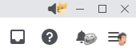
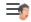

# Memessages

## EN | [RU](./README.ru.md)

___

Plays sound memes when receiving messages

## Installation
- Download and install [BetterDiscord](https://betterdiscord.app/)
- Download plugin [Memessages.plugin.js](https://raw.githubusercontent.com/Greezor/DiscordMemessages/master/Memessages.plugin.js)
- Install plugin: [Guide](https://docs.betterdiscord.app/users/guides/installing-addons)

## Screenshot

## How to use
-  - Mute button
-  - Enable meme notifications for current channel
-  - Plugin settings (sidebar)

## Features
- [x] Mute button 
- [x] Volume slider
- [x] Sounds history
- [x] Chaos mode!
- [x] Auto-update
- [x] Sound Modificators
- [x] Cooldown mode
- [ ] Hotkeys

### Modificators

- [*G*%] - sound gain. **G** - percentages. Default value: G = `100`. Sample: `[200%]`.
- [bb*N*] - bass boost. **N** - level. Default value: N = `0`. Sample: `[bb1]`.
- [>>*S*] - sets playback rate. **S** - speed in percentages. Default value: S = `100`. Sample: `[>>200]`.
- [#] - disables automatic pitch preserving. Requires set playback rate.
- [echo] - adds echo.
- [*I*] - chooses the sound by number from found sounds. **I** - sound index. Default value: I = `0` (chooses the first). Sample: `[1]` (chooses the second).
- [!] - important flag, disables all sound and start play current.
- [*L*] - sets language for meowpad search. **L** - language code. Default value: `auto`. Available values: `ru` or `en`.

## Support me
- [Boosty](https://boosty.to/greezor)

## Thanks to
- [Discord](https://discord.com/)
- [BetterDiscord](https://betterdiscord.app/)
- [Meowpad](https://meowpad.me/)
- [Font Awesome](https://fontawesome.com/)
- [Icons8](https://icons8.com/)