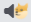

# Memessages

## [EN](./README.md) | RU

___

Проигрывает звуковые мемы при получении сообщений

## Установка
- Скачать и установить [BetterDiscord](https://betterdiscord.app/)
- Скачать плагин `Memessages.plugin.js`
- Установить плагин: [Гайд](https://docs.betterdiscord.app/users/guides/installing-addons)

## Скриншот

## Как использовать
-  - Отключить звук
-  - Включить мемные уведомления для текущего канала/беседы
-  - Настройки плагина (сайдбар)

## Фичи
- [x] Кнопка отключения звука 
- [x] Слайдер громкости
- [x] История звуков
- [x] Режим Хаоса!
- [x] Авто-обновление
- [ ] Модификаторы звуков
- [ ] Горячие клавиши
- [ ] Режим задержки между звуками

## Поддержать меня
- [Boosty](https://boosty.to/greezor)

## Спасибо
- [Discord](https://discord.com/)
- [BetterDiscord](https://betterdiscord.app/)
- [Meowpad](https://meowpad.me/)
- [Font Awesome](https://fontawesome.com/)
- [Icons8](https://icons8.ru/)